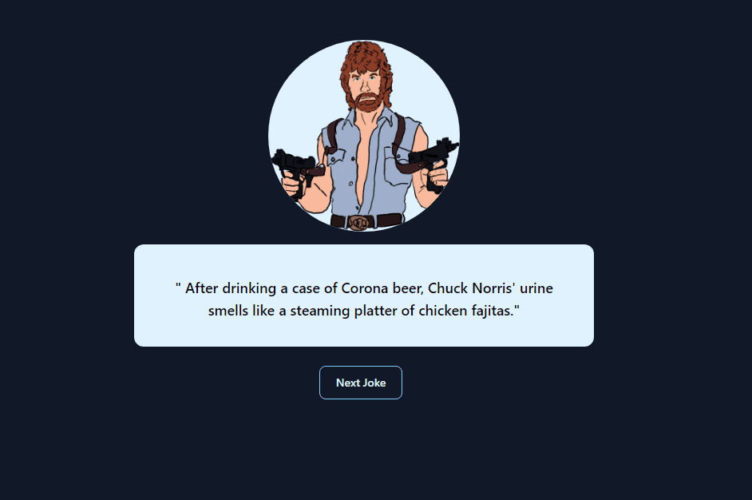

# Base Project in React (with Tailwind and Typescript)

---
## Test the app clicking here:

<a href="https://chuck-norris-jokes-40l74o9yr-beceluiz.vercel.app"> Chuck Norris Jokes <a/>

## ⚠️ important Info ⚠️
Dont forget to run `npm install` to install all depenencies before running the project.

---
## 🚀 Technologies Used

  - React
  - Typescript
  - TailwindCSS

## Available Scripts

In the project directory, you can run:

### `npm start`

Runs the app in the development mode.\
Open [http://localhost:3000](http://localhost:3000) to view it in the browser.

The page will reload if you make edits.\
You will also see any lint errors in the console.

### `npm test`

Launches the test runner in the interactive watch mode.\
See the section about [running tests](https://facebook.github.io/create-react-app/docs/running-tests) for more information.

